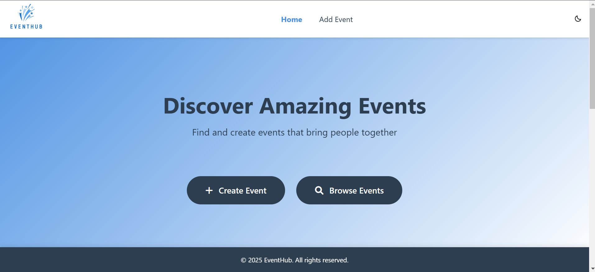
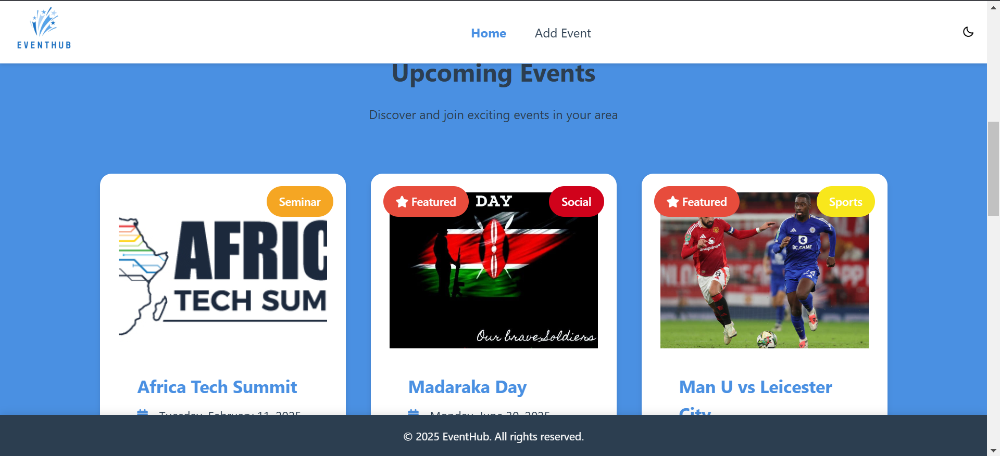
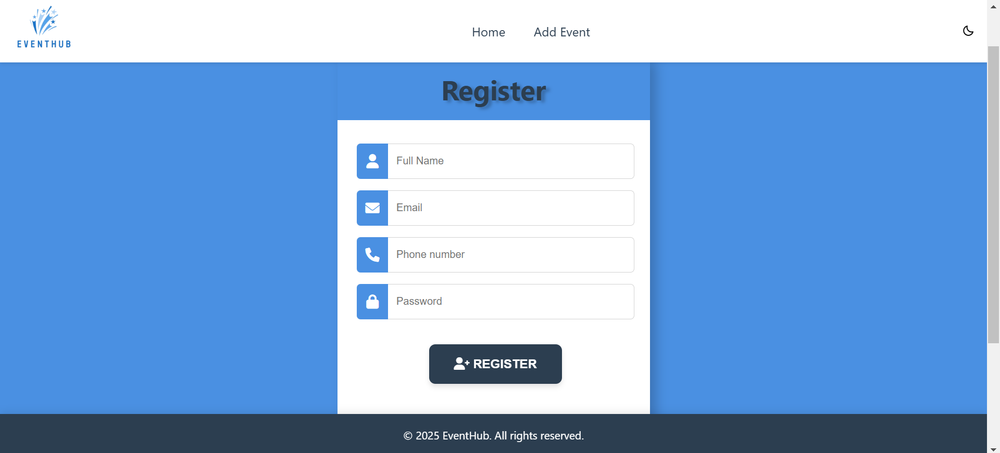
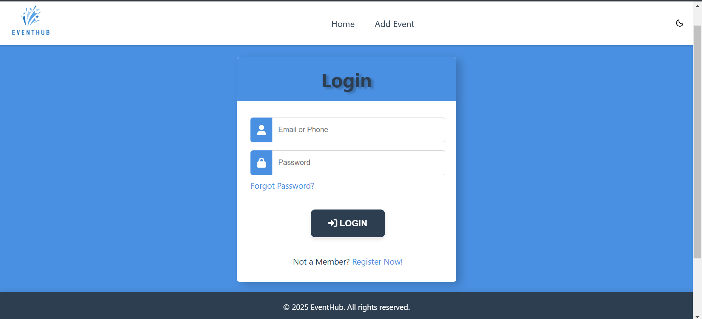
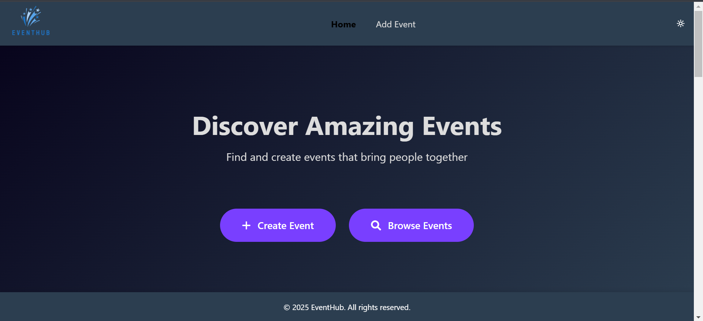

# Event Hub 🌟  
A comprehensive, interactive Event Management System designed to streamline event creation, management, and organization. This project features a clean, responsive interface built with HTML, CSS, and JavaScript, paired with a robust Node.js and MySQL backend for efficient data handling.

---

## Features 🎉  

### Core Functionality  
- **User-Friendly Interface**: Modern and responsive design with smooth navigation.  
- **Event Management**:  
  - Add new events with title, description, and date.  
  - View all events in a structured grid or list format.  
  - Access detailed event information.  
  - Update existing event details.  
  - Delete events with confirmation prompts.  
- **User Authentication**:  
  - Secure login and registration system for personalized event management.  
  - Password recovery through a **Forgot Password** feature.  
  - Encrypted user data for enhanced security.  
- **Form Validation**: Ensure proper input with client-side and server-side checks, including date restrictions for future events.  

### Bonus Enhancements  
- **Improved User Experience**:  
  - Dark and light mode toggle.  
  - Loading and error states with clear feedback.  
- **Advanced Event Tools**:  
  - Categorization and tagging for events.  
  - Search, filter, and sort functionality.  
  - Event image uploads for visual appeal.  
- **Sharing Options**: Allow users to share event details across platforms.  

### Deployment  
The application is deployed online, offering easy access and a seamless demo experience.  

---

## Technical Stack 💻  

### Frontend  
- HTML5 for structure.  
- CSS3 for styling and animations.  
- Vanilla JavaScript for interactivity.  

### Backend  
- Node.js with Express.js for server-side logic.  
- MySQL for database management.  
- RESTful API design for clear communication between frontend and backend.  

---

## Project Structure 📁  
```
event-hub/
├── public/
│   ├── css/
│   │   └── style.css
│   └── js/
│       └── script.js
├── views/
│   ├── index.html
│   ├── add-event.html
│   ├── view-event.html
│   ├── register.html
│   ├── login.html
│   └── forgot.html
├── server.js
├── db.sql
├── .env
├── package.json
└── README.md
```

---

## Screenshots 📸  

### Home Page  
  
A modern and intuitive landing page that welcomes users and provides easy navigation.  

### Event Management  
  
Effortlessly browse, add, edit, and delete events with a structured layout.  

### User Authentication  
#### Register Page  
  
Secure user registration with real-time validation.  

#### Login Page  
  
Simple and secure login for personalized event management.  

### Dark theme  

Elegant dark mode to reduce eye strain and enhance focus.

---

## Installation and Setup 🛠️  

### Prerequisites  
Ensure the following are installed on your system:  
- Node.js (v14 or higher).  
- MySQL (v8.0 or higher).  
- Git for version control.  

### Steps  
1. **Clone the repository**:  
   git clone <repository-url>

2. **Install dependencies**:  
   npm install

3. **Set up the database**:  
   mysql -u root -p < db.sql

4. **Configure environment variables**:  
   Create a `.env` file in the root directory with the following:  
   DB_HOST=localhost
   DB_USER=your_username
   DB_PASSWORD=your_password
   DB_NAME=event_manager_db

5. **Start the server**:  
   node server.js
   Access the app at localhost:3000

   or 

   Online: https://web-production-2ef4.up.railway.app/
---

## API Endpoints 🌐  
- **GET** `/api/events`: Retrieve all events.  
- **GET** `/api/events/:id`: Fetch details of a specific event.  
- **POST** `/add-event`: Add a new event.  
- **DELETE** `/api/events/:id`: Remove an event by ID.  
- **POST** `/register`: Register a new user.  
- **POST** `/login`: Authenticate an existing user.  
- **POST** `/forgot`: Handle password recovery.  

---

## Contribution 🤝  
Contributions are welcome! If you'd like to enhance this project, feel free to fork the repository, make your changes, and open a pull request.  

---

## License 📜  
This project is licensed under the MIT License.